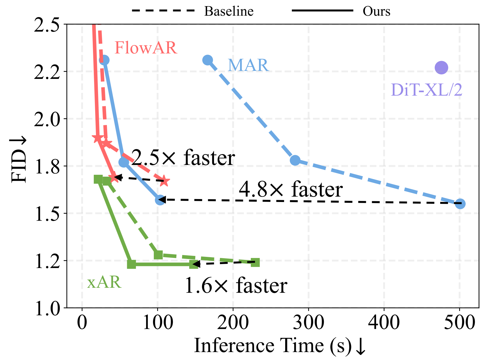

<h1 align="center"> DiSA: Diffusion Step Annealing in Autoregressive Image Generation </h1>

<p align="center">
  <a href="https://www.linkedin.com/in/qinyu-zhao/" target="_blank">Qinyu&nbsp;Zhao</a><sup>1</sup> &ensp; <b>&middot;</b> &ensp;
  <a href="https://1jsingh.github.io/" target="_blank">Jaskirat&nbsp;Singh</a><sup>1</sup> &ensp; <b>&middot;</b> &ensp;
  <a href="https://www.linkedin.com/in/ming-xu-2a21a754" target="_blank">Ming&nbsp;Xu</a><sup>1</sup> &ensp; <b>&middot;</b> &ensp;
  <a href="https://www.linkedin.com/in/akshayasthana" target="_blank">Akshay&nbsp;Asthana</a><sup>2</sup>&ensp; <b>&middot;</b> &ensp;
  <a href="https://users.cecs.anu.edu.au/~sgould/" target="_blank">Stephen&nbsp;Gould</a><sup>1</sup>&ensp; <b>&middot;</b> &ensp;
  <a href="https://zheng-lab-anu.github.io/" target="_blank">Liang&nbsp;Zheng</a><sup>1</sup>&ensp;
</p>

<p align="center">
  <sup>1</sup> Australian National University &emsp; <sup>2</sup> Seeing Machines &emsp; <br>
</p>

<p align="center">
  <a href="https://qinyu-allen-zhao.github.io/DiSA/">🌐 Project Page</a> &ensp;
  <a href="">📃 Paper</a> &ensp;
  <br><br>
</p>

## Overview
Recent autoregressive models like MAR, FlowAR, xAR, and Harmon adopt diffusion sampling to improve the quality of image generation. However, this approach leads to slow inference speed, because it usually requires 50-100 diffusion steps per token. We introduce Diffusion Step Annealing (**DiSA**), a training-free method which gradually reduces the number of diffusion steps as more tokens are generated, achieving significant speedup while maintaining generation quality, as shown below.

<p align="center">
  
</p>

## News and Updates
**[2025-05-25]** Initial Release with Codebase.

## Getting Started
### 1. Environment Setup
To set up our environment, please run:

```
git clone https://github.com/Qinyu-Allen-Zhao/DiSA.git
cd DiSA
conda env create -f environment.yml -y
conda activate disa
pip install flash-attn==2.3.4 --no-build-isolation  # For Harmon only
```

### 2. Prepare the Pretrained Models
DiSA is a training-free method that can be integrated into existing models with just a few lines of code. We have applied DiSA to MAR, FlowAR, xAR, and Harmon. To use these implementations, please navigate to the corresponding folder and follow the instructions in the README to download the required models. For example, for MAR, go to the `MAR_DiSA` directory and run:`python util/download.py`.

### 3. Accelerate Existing Models with DiSA
#### 3.1 MAR
Evaluate MAR-B (DiffLoss MLP with 6 blocks and a width of 1024 channels, 800 epochs) with classifier-free guidance:
```
torchrun --nproc_per_node=4 --nnodes=1 --node_rank=0 \
main_mar.py \
--model mar_base --diffloss_d 6 --diffloss_w 1024 \
--eval_bsz 256 --num_images 50000 \
--num_iter 64 --cfg 2.9 --cfg_schedule linear --temperature 1.0 \
--diff_upper_steps 50 --diff_lower_steps 5 --diff_annealing_strategy linear --diff_sampler DiSA \
--output_dir pretrained_models/mar/mar_base \
--resume pretrained_models/mar/mar_base \
--data_path ${IMAGENET_PATH} --evaluate
```

Evaluate MAR-L (DiffLoss MLP with 8 blocks and a width of 1280 channels, 800 epochs) with classifier-free guidance:
```
torchrun --nproc_per_node=4 --nnodes=1 --node_rank=0 \
main_mar.py \
--model mar_large --diffloss_d 8 --diffloss_w 1280 \
--eval_bsz 256 --num_images 50000 \
--num_iter 64 --cfg 3.0 --cfg_schedule linear --temperature 1.0 \
--diff_upper_steps 50 --diff_lower_steps 5 --diff_annealing_strategy linear --diff_sampler DiSA \
--output_dir pretrained_models/mar/mar_large \
--resume pretrained_models/mar/mar_large \
--data_path ${IMAGENET_PATH} --evaluate
```

Evaluate MAR-H (DiffLoss MLP with 12 blocks and a width of 1536 channels, 800 epochs) with classifier-free guidance:
```
torchrun --nproc_per_node=8 --nnodes=1 --node_rank=0 \
main_mar.py \
--model mar_huge --diffloss_d 12 --diffloss_w 1536 \
--eval_bsz 128 --num_images 50000 \
--num_iter 64 --cfg 3.3 --cfg_schedule linear --temperature 1.0 \
--diff_upper_steps 50 --diff_lower_steps 5 --diff_annealing_strategy linear --diff_sampler DiSA \
--output_dir pretrained_models/mar/mar_huge \
--resume pretrained_models/mar/mar_huge \
--data_path ${IMAGENET_PATH} --evaluate
```

- We replace the original arguments `--num_iter 256 --num_sampling_steps 100` with `--num_iter 64 --diff_upper_steps 50 --diff_lower_steps 5 --diff_annealing_strategy linear --diff_sampler DiSA`. This configuration uses 50 diffusion steps during the early stages of generation and gradually reduces them to 5 in later stages, achieving approximately 5× speed-up on MAR.
- To revert to the original sampling settings, please use: `--num_iter 256 --diff_upper_steps 100 --diff_sampler default`. This setup corresponds to 100 diffusion steps and 256 autoregressive iterations.
- We also provide support for other diffusion samplers on MAR, including DDIM, DPM-Solver, and DPM-Solver++. These can be enabled via `--diff_sampler DDIM/DPM_Solver/DPM_Solver++`. Note: these samplers are currently incompatible with classifier-free guidance.. 
- While we generally retain the default classifier-free guidance (cfg) value, we found that the default setting for MAR-H is suboptimal both with and without DiSA. Therefore, we set the cfg value to 3.3 for improved performance.

#### 3.2 FlowAR

Evaluate FlowAR-S with classifier-free guidance:
```
torchrun --nproc_per_node=4 \
eval.py \
--model flowar_small --diffloss_d 2 --diffloss_w 1024 \
--eval_bsz 256 --num_images 50000 --flow_upper_steps 25 --flow_lower_steps 15 --cfg 4.2 --guidance 0.9 \
--output_dir /path/to/output_dir \
--resume /path/to/FlowAR-S.pth --vae_path /path/to/MAR/kl16.ckpt \
--data_path /path/to/imagenet1k/ --evaluate
```

Evaluate FlowAR-L with classifier-free guidance:
```
torchrun --nproc_per_node=4 \
eval.py \
--model flowar_large --diffloss_d 12 --diffloss_w 1024 \
--eval_bsz 256 --num_images 50000 --flow_upper_steps 25 --flow_lower_steps 15 --cfg 2.4 --guidance 0.9 \
--output_dir /path/to/output_dir \
--resume /path/to/FlowAR-L.pth --vae_path /path/to/MAR/kl16.ckpt \
--data_path /path/to/imagenet1k/ --evaluate
```

Evaluate FlowAR-H with classifier-free guidance:
```
torchrun --nproc_per_node=4 \
eval.py \
--model flowar_huge --diffloss_d 12 --diffloss_w 1536 \
--eval_bsz 256 --num_images 50000 --flow_upper_steps 50 --flow_lower_steps 15 --cfg 2.4 --guidance 0.7 \
--output_dir /path/to/output_dir \
--resume /path/to/FlowAR-H.pth --vae_path /path/to/MAR/kl16.ckpt \
--data_path /path/to/imagenet1k/ --evaluate
```

- The main change to the arguments is replacing `--num_step XXX` with `--flow_upper_steps XXX --flow_lower_steps 15`
- DiSA achieves approximately 1.5× speed-up on FlowAR-S and -L, while 2.5x on FlowAR-H.

#### 3.3 xAR
Evaluate xAR-B with classifier-free guidance:
```
torchrun --nproc_per_node=4 \
eval.py \
--model xar_base \
--eval_bsz 256 --num_images 50000 \
--flow_upper_steps 50 --flow_lower_steps 15 --cfg 2.7 \
--output_dir /path/to/out_sample/ \
--resume ../ckpt/xAR-B.pth --vae_path /path/to/vae/kl16.ckpt \
--data_path /path/to/imagenet1k/ --evaluate
```

Evaluate xAR-L with classifier-free guidance:
```
torchrun --nproc_per_node=4 \
eval.py \
--model xar_large \
--eval_bsz 256 --num_images 50000 \
--flow_upper_steps 50 --flow_lower_steps 15 --cfg 2.3 \
--output_dir /path/to/out_sample/ \
--resume ../ckpt/xAR-L.pth --vae_path /path/to/vae/kl16.ckpt \
--data_path /path/to/imagenet1k/ --evaluate
```

Evaluate xAR-H with classifier-free guidance:
```
torchrun --nproc_per_node=4 \
eval.py \
--model xar_huge \
--eval_bsz 256 --num_images 50000 \
--flow_upper_steps 50 --flow_lower_steps 15 --cfg 2.2 \
--output_dir /path/to/out_sample/ \
--resume ../ckpt/xAR-H.pth --vae_path /path/to/vae/kl16.ckpt \
--data_path /path/to/imagenet1k/ --evaluate
```

- The main change to the arguments is replacing `--num_iter 256 --num_step 50` with `--flow_upper_steps 50 --flow_lower_steps 15`
- DiSA achieves approximately 1.6× speed-up on xAR.

#### 3.4 Harmon
Run Harmon with DiSA using the following command:
```
export PYTHONPATH=./:$PYTHONPATH

python scripts/text2image.py \
configs/models/qwen2_5_1_5b_kl16_mar_h_disa_50_5.py \
--checkpoint checkpoints/harmon_1.5b.pth  --image_size 512 \
--prompt 'a dog on the left and a cat on the right.'  --output output.jpg
```

## Acknowledgement
This codebase builds upon several excellent open-source projects, including:
- [MAR](https://github.com/LTH14/mar)
- [FlowAR](https://github.com/OliverRensu/FlowAR)
- [xAR](https://github.com/OliverRensu/xAR)
- [Harmon](https://github.com/wusize/Harmon)

We sincerely thank the authors for making their work and models publicly available.

## Citation
If you find our work useful, please consider citing:

```bibtex
@article{zhao2025disa,
  title={DiSA: Diffusion Step Annealing in Autoregressive Image Generation},
  author={Zhao, Qinyu and Singh, Jaskirat and Xu, Ming and Asthana, Akshay and Gould, Stephen and Zheng, Liang},
  year={2025},
  journal={arXiv preprint},
}
```