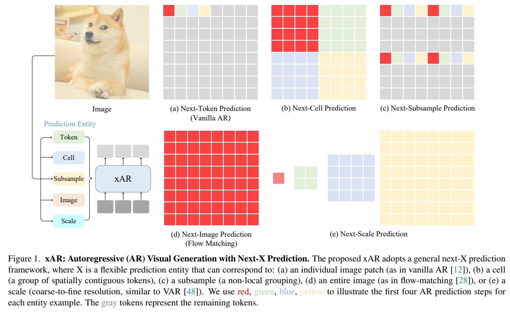

# Beyond Next-Token: Next-X Prediction for Autoregressive Visual Generation

[](https://arxiv.org/abs/2502.20388)&nbsp;
[](https://paperswithcode.com/sota/image-generation-on-imagenet-256x256?flowar-scale-wise-autoregressive-image)
[](https://huggingface.co/OliverRen/xAR)&nbsp;
[](https://oliverrensu.github.io/project/xAR/)

This repository is the official implementation of our [Beyond Next-Token: Next-X Prediction for Autoregressive Visual Generation](https://arxiv.org/abs/2502.20388)
## Introduction
Autoregressive (AR) modeling, known for its next-token prediction paradigm, underpins state-of-the-art language and visual generative models. Traditionally, a token is treated as the smallest prediction unit, often a discrete symbol in language or a quantized patch in vision. However, the optimal token definition for 2D image structures remains an open question. Moreover, AR models suffer from exposure bias, where teacher forcing during training leads to error accumulation at inference. In this paper, we propose xAR, a generalized AR framework that extends the notion of a token to an entity X, which can represent an individual patch token, a cell (a k×k grouping of neighboring patches), a subsample (a non-local grouping of distant patches), a scale (coarse-to-fine resolution), or even a whole image. Additionally, we reformulate discrete token classification as continuous entity regression, leveraging flow-matching methods at each AR step. This approach conditions training on noisy entities instead of ground truth tokens, leading to Noisy Context Learning, which effectively alleviates exposure bias. As a result, xAR offers two key advantages: (1) it enables flexible prediction units that capture different contextual granularity and spatial structures, and (2) it mitigates exposure bias by avoiding reliance on teacher forcing. On ImageNet-256 generation benchmark, our base model, xAR-B (172M), outperforms DiT-XL/SiT-XL (675M) while achieving 20× faster inference. Meanwhile, xAR-H sets a new state-of-the-art with an FID of 1.24, running 2.2× faster than the previous best-performing model without relying on vision foundation modules (e.g., DINOv2) or advanced guidance interval sampling.


## Preparation

We adopt the tokenizer from [MAR](https://github.com/LTH14/mar) and put it in /path/to/MAR/vae

Download ImageNet dataset and cache VAE latents as [MAR](https://github.com/LTH14/mar)

## Training
Keep overall batch size of 2048. 

Train xAR-B
```python
torchrun --nproc_per_node=8 --nnodes=4 --node_rank=0,...3 --master_addr=$host_ip --master_port=$port \
main_mar.py \
--img_size 256 --vae_path /path/to/kl16.ckpt --vae_embed_dim 16 --vae_stride 16 --patch_size 1 \
--model xar_base \
--epochs 800 --warmup_epochs 100 --batch_size 64 --blr 5e-5 \
--output_dir ./output_dir/ --resume ./output_dir/ \
--data_path /path/to/imagenet1k/ --use_cached --cached_path /path/to/imagenet_feature/
```

Train xAR-L
```python
torchrun --nproc_per_node=8 --nnodes=8 --node_rank=0,...,7 --master_addr=$host_ip --master_port=$port \
main_mar.py \
--img_size 256 --vae_path /path/to/kl16.ckpt --vae_embed_dim 16 --vae_stride 16 --patch_size 1 \
--model xar_large \
--epochs 800 --warmup_epochs 100 --batch_size 32 --blr 5e-5 \
--output_dir ./output_dir/ --resume ./output_dir/ \
--data_path /path/to/imagenet1k/ --use_cached --cached_path /path/to/imagenet_feature/
```

Train xAR-H
```python
torchrun --nproc_per_node=8 --nnodes=8 --node_rank=0,...,7 --master_addr=$host_ip --master_port=$port \
main_mar.py \
--img_size 256 --vae_path /path/to/kl16.ckpt --vae_embed_dim 16 --vae_stride 16 --patch_size 1 \
--model xar_huge \
--epochs 800 --warmup_epochs 100 --batch_size 32 --blr 5e-5 \
--output_dir ./output_dir/ --resume ./output_dir/ \
--data_path /path/to/imagenet1k/ --use_cached --cached_path /path/to/imagenet_feature/
```
If you face "NaN", please disable mixed precision and use only TF32.
## Evaluation
The pretrained weights are available at [huggingface🤗](https://huggingface.co/OliverRen/xAR)

Evaluate xAR-B with classifier-free guidance:
```puthon
torchrun --nproc_per_node=8 --master_port=6781 \
eval.py \
--model xar_base \
--eval_bsz 256 --num_images 50000 \
--num_iter 256 --num_steps 40  --cfg 2.7 \
--output_dir /path/to/out_sample/ \
--resume ../ckpt/xAR-B.pth --vae_path /path/to/vae/kl16.ckpt \
--data_path /path/to/imagenet1k/ --evaluate
```

Evaluate xAR-L with classifier-free guidance:
```puthon
torchrun --nproc_per_node=8 --master_port=6781 \
eval.py \
--model xar_large \
--eval_bsz 256 --num_images 50000 \
--num_iter 256 --num_steps 50  --cfg 2.3 \
--output_dir /path/to/out_sample/ \
--resume ../ckpt/xAR-L.pth --vae_path /path/to/vae/kl16.ckpt \
--data_path /path/to/imagenet1k/ --evaluate
```

Evaluate xAR-H with classifier-free guidance:
```puthon
torchrun --nproc_per_node=8 --master_port=6781 \
eval.py \
--model xar_huge \
--eval_bsz 256 --num_images 50000 \
--num_iter 256 --num_steps 50  --cfg 2.2 \
--output_dir /path/to/out_sample/ \
--resume ../ckpt/xAR-H.pth --vae_path /path/to/vae/kl16.ckpt \
--data_path /path/to/imagenet1k/ --evaluate
```

## Reference
If you have any question, feel free to contact [Sucheng Ren](oliverrensu@gmail.com)

```
@article{ren2025xar,
       title={Beyond Next-Token: Next-X Prediction for Autoregressive Visual Generation}, 
       author={Sucheng, Ren and Qihang, Yu and Ju, He and Xiaohui, Shen and Alan, Yuille and Liang-Chieh, Chen},
       year={2025},
        journal={arXiv preprint arXiv:2502.20388}}
```

## Acknowledgement
[VAR](https://github.com/FoundationVision/VAR)
[MAR](https://github.com/LTH14/mar)
